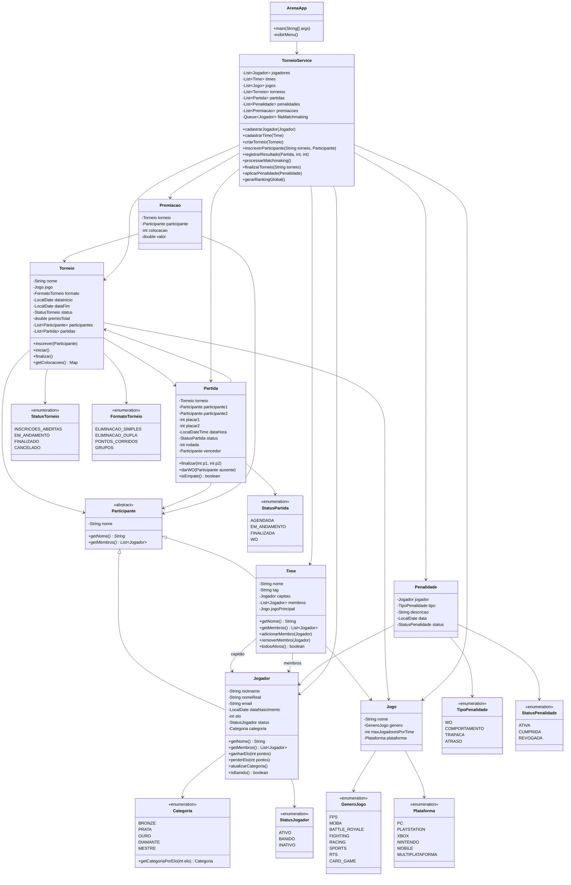

# Projeto Java — Sistema de Gerenciamento de Torneios de E-Sports

Projeto prático para relembrar e consolidar **Java com OOP**, cobrindo herança, polimorfismo, encapsulamento, collections, streams, enums e tratamento de exceções — tudo no universo de **games e e-sports**.

---

## 📌 1. Visão Geral do Projeto

Você vai construir um **Sistema de Gerenciamento de Torneios de E-Sports** via console (CLI) que permite cadastrar jogadores, montar times, criar torneios, registrar partidas, calcular rankings e gerenciar premiações.

📍 **Tipo:** Aplicação console (CLI)

📍 **Linguagem:** Java 17+

📍 **Paradigma:** Orientação a Objetos (OOP)

📍 **Persistência:** Em memória (Collections) — sem banco de dados por enquanto

📍 **Build tool:** Maven ou Gradle (recomendado: Maven)

> 💡 **Evolução futura:** Depois de concluir a versão console, você pode transformar isso em uma API REST com Spring Boot + integração com Discord Bot. Mas primeiro, foco no core.
> 

---

## 📌 2. Regras de Negócio

### 📍 RN01 — Cadastro de Jogadores

- Cada jogador possui: nickname (único), nome real, email, data de nascimento, ranking (ELO), status e categoria
- **Categorias** (calculadas automaticamente pelo ELO):
    - `BRONZE` → ELO 0–999
    - `PRATA` → ELO 1000–1499
    - `OURO` → ELO 1500–1999
    - `DIAMANTE` → ELO 2000–2499
    - `MESTRE` → ELO 2500+
- Todo jogador começa com **ELO 1000** (Prata)
- Não é permitido cadastrar dois jogadores com o mesmo nickname
- Status possíveis: `ATIVO`, `BANIDO`, `INATIVO`
- Jogadores `BANIDO` ou `INATIVO` **não podem** participar de torneios

### 📍 RN02 — Cadastro de Jogos

- Cada jogo possui: nome, gênero, número máximo de jogadores por time e plataforma
- Gêneros: `FPS`, `MOBA`, `BATTLE_ROYALE`, `FIGHTING`, `RACING`, `SPORTS`, `RTS`, `CARD_GAME`
- Plataformas: `PC`, `PLAYSTATION`, `XBOX`, `NINTENDO`, `MOBILE`, `MULTIPLATAFORMA`
- Não é permitido cadastrar dois jogos com o mesmo nome

### 📍 RN03 — Times

- Dois tipos de participantes: **Jogador Solo** e **Time**
- **Time** possui: nome (único), tag (3-5 caracteres, única), capitão (um jogador), lista de membros, jogo principal
- O capitão **deve** ser um dos membros do time
- Número de membros deve respeitar o `maxJogadoresPorTime` do jogo principal
- Um jogador **não pode** estar em dois times diferentes **para o mesmo jogo**
- Um jogador **pode** estar em times de jogos diferentes

### 📍 RN04 — Torneios

- Cada torneio possui: nome, jogo, formato, data de início, data de fim, status, prêmio total (em R$), lista de participantes (times ou solos) e lista de partidas
- **Formatos:** `ELIMINACAO_SIMPLES`, `ELIMINACAO_DUPLA`, `PONTOS_CORRIDOS`, `GRUPOS`
- **Status:** `INSCRICOES_ABERTAS`, `EM_ANDAMENTO`, `FINALIZADO`, `CANCELADO`
- Mínimo de **4 participantes** para iniciar um torneio
- Máximo de **32 participantes** por torneio
- Não é possível adicionar participantes quando o torneio **não** está em `INSCRICOES_ABERTAS`
- Jogadores banidos ou inativos **não podem** se inscrever
- Todos os membros de um time devem estar `ATIVO` para o time se inscrever
- O jogo do torneio deve ser compatível com os times inscritos (verificar `maxJogadoresPorTime`)

### 📍 RN05 — Partidas (Matches)

- Cada partida possui: torneio, participante 1, participante 2, placar 1, placar 2, data/hora, status, rodada e vencedor
- **Status:** `AGENDADA`, `EM_ANDAMENTO`, `FINALIZADA`, `WO` (walkover)
- Ao finalizar uma partida:
    - O vencedor ganha **+25 ELO** (distribuído aos membros se for time)
    - O perdedor perde **-15 ELO**
    - ELO mínimo é **0** (nunca fica negativo)
    - Empate: ambos ganham **+5 ELO**
- Em caso de **WO** (participante não compareceu):
    - O ausente perde **-30 ELO** e recebe uma **penalidade**
    - O presente ganha **+10 ELO**

### 📍 RN06 — Penalidades

- Penalidades são geradas por WO ou comportamento irregular
- Cada penalidade possui: jogador/time, tipo, descrição, data, status
- **Tipos:** `WO`, `COMPORTAMENTO`, `TRAPACA`, `ATRASO`
- Ao acumular **3 penalidades ativas**, o jogador é automaticamente `BANIDO`
- Penalidades possuem status: `ATIVA`, `CUMPRIDA`, `REVOGADA`

### 📍 RN07 — Fila de Matchmaking

- Jogadores podem entrar na **fila de matchmaking** para partidas rápidas (fora de torneio)
- A fila funciona por **FIFO** (First In, First Out), mas com **filtro por categoria**:
    - Jogadores só são pareados com outros da **mesma categoria** ou **uma categoria acima/abaixo**
    - Ex: um `PRATA` pode jogar contra `BRONZE`, `PRATA` ou `OURO`
- Quando dois jogadores compatíveis estão na fila, uma partida rápida é criada automaticamente
- Jogadores banidos **não podem** entrar na fila

### 📍 RN08 — Premiação

- Ao finalizar um torneio, a premiação é distribuída:
    - 🥇 **1º lugar:** 50% do prêmio total
    - 🥈 **2º lugar:** 30% do prêmio total
    - 🥉 **3º lugar:** 20% do prêmio total
- Se for time, o prêmio é dividido **igualmente** entre os membros
- Premiação possui: torneio, participante, colocação, valor

### 📍 RN09 — Relatórios e Rankings

- 🏆 **Ranking global** dos jogadores por ELO (top 10)
- 📊 **Jogadores com mais vitórias** (top 10)
- 📊 **Times com maior win rate** (vitórias/total de partidas)
- 📊 **Torneios ativos** e seus participantes
- 📊 **Jogadores mais penalizados**
- 📊 **Distribuição de jogadores por categoria** (quantos em cada tier)

---

## 📌 3. Diagrama de Classes



---

## 📌 4. Estrutura de Pacotes

```
src/
└── main/
    └── java/
        └── com.arena/
            ├── model/
            │   ├── Participante.java      (classe abstrata)
            │   ├── Jogador.java
            │   ├── Time.java
            │   ├── Jogo.java
            │   ├── Torneio.java
            │   ├── Partida.java
            │   ├── Penalidade.java
            │   └── Premiacao.java
            ├── enums/
            │   ├── Categoria.java
            │   ├── GeneroJogo.java
            │   ├── Plataforma.java
            │   ├── StatusJogador.java
            │   ├── StatusTorneio.java
            │   ├── StatusPartida.java
            │   ├── FormatoTorneio.java
            │   ├── TipoPenalidade.java
            │   └── StatusPenalidade.java
            ├── service/
            │   └── TorneioService.java
            ├── exception/
            │   ├── JogadorBanidoException.java
            │   ├── TorneioLotadoException.java
            │   ├── InscricaoFechadaException.java
            │   ├── TimeIncompletoException.java
            │   ├── NicknameDuplicadoException.java
            │   └── PenalidadeMaximaException.java
            └── ArenaApp.java              (main + menu)
```

---

## 📌 5. Conceitos Java Que Você Vai Praticar

| **Conceito** | **Onde aparece no projeto** |
| --- | --- |
| **Herança** (inheritance) | `Participante` → `Jogador`, `Time` |
| **Classe abstrata** (abstract class) | `Participante` com métodos abstratos `getNome()` e `getMembros()` |
| **Polimorfismo** (polymorphism) | Torneio aceita qualquer `Participante` — solo ou time, tratados de forma uniforme |
| **Encapsulamento** (encapsulation) | ELO só muda via `ganharElo()` / `perderElo()`, categoria recalcula automaticamente |
| **Enums com comportamento** | `Categoria.getCategoriaPorElo(int)` — enum com método estático de lookup |
| **Collections — `List`** | Listas de jogadores, times, torneios, partidas, penalidades |
| **Collections — `Map`** | Colocações do torneio, distribuição por categoria, win rates |
| **Collections — `Queue`** | Fila de matchmaking (FIFO com filtro por categoria) |
| **Streams + Collectors** | Rankings, top 10, agrupamentos por categoria, win rates, filtros |
| **java.time API** | `LocalDate` para torneios/penalidades, `LocalDateTime` para partidas |
| **Exceptions customizadas** | Validações de negócio: jogador banido, torneio lotado, inscrição fechada, etc. |
| **Optional** | Busca de jogador por nickname, time por tag, torneio por nome |
| **Composição** (composition) | `Time` composto por `Jogador`, `Torneio` composto por `Partida` |

---

## 📌 6. Fases de Implementação

Siga essa ordem pra não se perder. Cada fase constrói em cima da anterior.

### 📍 Fase 1 — Enums e Modelos Base

- [ ]  Criar todos os enums: `Categoria`, `GeneroJogo`, `Plataforma`, `StatusJogador`, `StatusTorneio`, `StatusPartida`, `FormatoTorneio`, `TipoPenalidade`, `StatusPenalidade`
- [ ]  Implementar `Categoria` com método `getCategoriaPorElo(int elo)`
- [ ]  Criar `Jogo` com validações básicas
- [ ]  Criar a classe abstrata `Participante`

> 💡 **Dica:** Comece pelos enums — eles são simples e já te colocam no ritmo do Java.
> 

### 📍 Fase 2 — Jogador e Time

- [ ]  Criar `Jogador` estendendo `Participante` (ELO inicial = 1000, categoria auto-calculada)
- [ ]  Implementar `ganharElo()`, `perderElo()` e `atualizarCategoria()`
- [ ]  Criar `Time` estendendo `Participante` (validar capitão nos membros, limite de jogadores)
- [ ]  Sobrescrever `toString()` em ambas as classes

> 💡 **Teste rápido:** Crie um jogador, ganhe/perca ELO e veja a categoria mudar automaticamente.
> 

### 📍 Fase 3 — Exceptions Customizadas

- [ ]  Criar `JogadorBanidoException`
- [ ]  Criar `TorneioLotadoException`
- [ ]  Criar `InscricaoFechadaException`
- [ ]  Criar `TimeIncompletoException`
- [ ]  Criar `NicknameDuplicadoException`
- [ ]  Criar `PenalidadeMaximaException`

### 📍 Fase 4 — Torneio e Partida

- [ ]  Criar `Torneio` com inscrição de participantes (validar status, limites, compatibilidade)
- [ ]  Criar `Partida` com lógica de finalização (distribuir ELO, definir vencedor)
- [ ]  Implementar WO com penalidade automática
- [ ]  Criar `Penalidade` e lógica de ban automático (3 penalidades = banido)
- [ ]  Criar `Premiacao` com cálculo de distribuição (50/30/20)

### 📍 Fase 5 — Service (lógica central)

- [ ]  Criar `TorneioService` com todas as listas
- [ ]  Implementar cadastros (jogador, time, jogo, torneio) com validação de duplicados
- [ ]  Implementar fluxo de inscrição em torneio (RN04)
- [ ]  Implementar registro de resultado de partida (RN05)
- [ ]  Implementar fila de matchmaking com filtro por categoria (RN07)
- [ ]  Implementar finalização de torneio + premiação (RN08)

### 📍 Fase 6 — Relatórios e Rankings (Streams)

- [ ]  Ranking global top 10 por ELO
- [ ]  Top 10 jogadores com mais vitórias
- [ ]  Win rate dos times
- [ ]  Torneios ativos com participantes
- [ ]  Jogadores mais penalizados
- [ ]  Distribuição por categoria (quantos em cada tier)

> 💡 Use `stream()`, `filter()`, `map()`, `sorted()`, `collect()`, `Collectors.groupingBy()`, `Collectors.counting()`, `Collectors.averagingDouble()`
> 

### 📍 Fase 7 — Menu Interativo (CLI)

- [ ]  Criar `ArenaApp` com `main()`
- [ ]  Menu organizado por seções: Jogadores, Times, Torneios, Partidas, Matchmaking, Rankings
- [ ]  Tratar inputs inválidos com `try-catch`
- [ ]  Seed data com jogadores, times e um torneio de exemplo pra testar

### 📍 Fase 8 (Bônus) — Evolução

- [ ]  Sistema de **temporadas** (seasons) com reset de ranking
- [ ]  **Histórico de partidas** por jogador com estatísticas (KDA, win rate)
- [ ]  **Bracket visual** no console (representação ASCII de chaves de eliminação)
- [ ]  Exportar rankings para `.txt` ou `.csv`
- [ ]  Migrar pra API REST com **Spring Boot** + integração com **Discord Bot**

---

## 📌 7. Dicas de Implementação

<aside>
⚠️

**Não comece pelo menu!** Comece pelos enums e modelos, depois o service, e só no final o menu. Se o core estiver sólido, o menu é só uma casca.

</aside>

<aside>
💡

**Commits semânticos em inglês** — aproveite pra praticar:

- `feat: add Player model with ELO ranking system`
- `feat: implement Team composition with captain validation`
- `feat: add Tournament registration with business rules`
- `feat: implement matchmaking queue with category filter`
- `fix: prevent banned players from joining tournaments`
- `refactor: extract ELO calculation to dedicated method`
</aside>

<aside>
🔍

**Teste manual progressivo:** A cada classe/método que implementar, teste no `main()` antes de avançar. Crie cenários: cadastre jogadores, forme um time, inscreva num torneio, simule partidas e veja o ELO mudar. Não espere tudo pronto.

</aside>

<aside>
🎯

**Desafio extra — pensa antes de codar:**

- Como garantir que o ELO nunca fique negativo?
- Como distribuir ELO proporcionalmente pros membros de um time?
- Como implementar o filtro de categoria no matchmaking sem quebrar a fila FIFO?

Tenta resolver essas questões no papel antes de escrever o código. 🧠

</aside>

---

> 🏆 *Ao final deste projeto, você terá praticado os pilares de OOP, Collections framework, Streams API, tratamento de exceções, composição, enums com comportamento e organização de código em camadas — tudo no contexto de um sistema de e-sports real.*
>